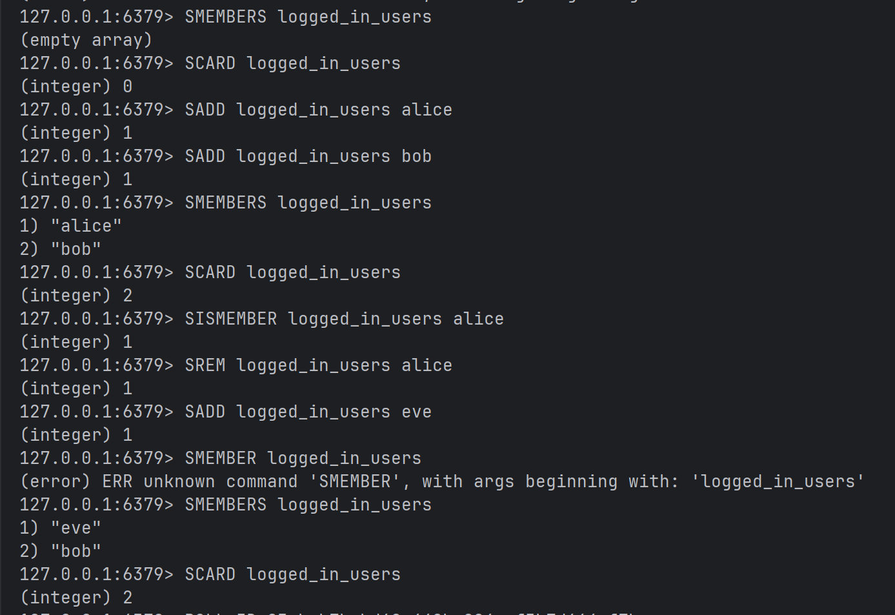
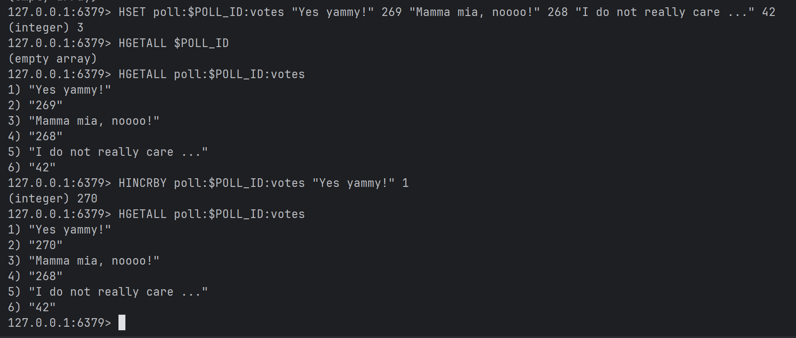

# DAT250 – Assignment 5

## Report by Endre

### Technical Problems Encountered

**405 on GET polls/{id}**  
*Fix:* Added handler for /polls/{id}

**Use case 1**

**Use case 2**

### Pending Issues

- Possible extensions

### Repository
[GitHub Repository](https://github.com/endrehj/poll-app-spring-boot-project)